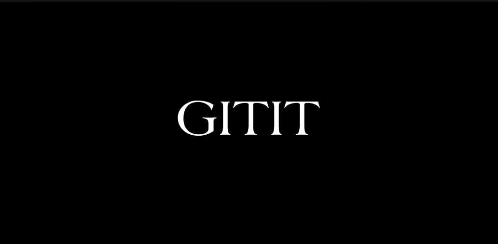
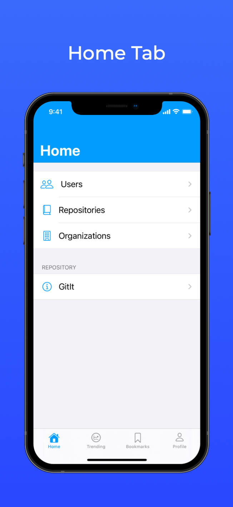
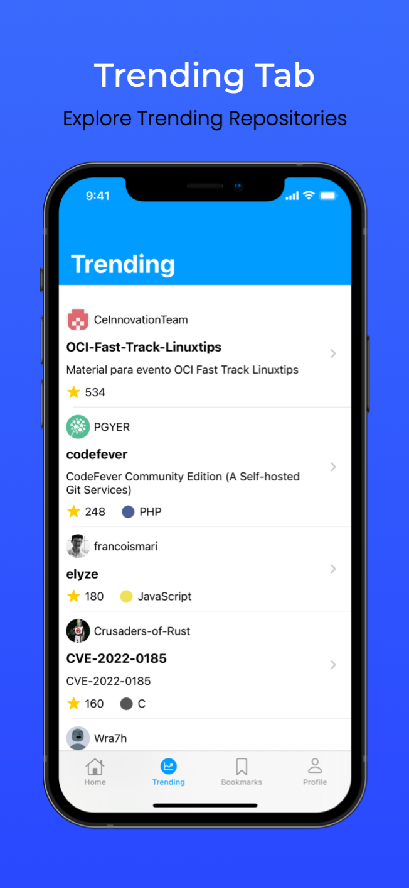
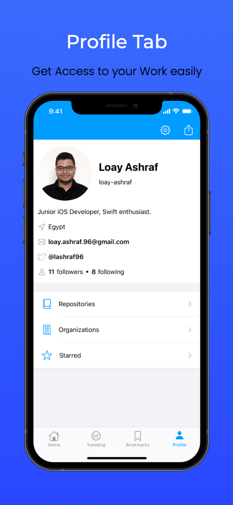
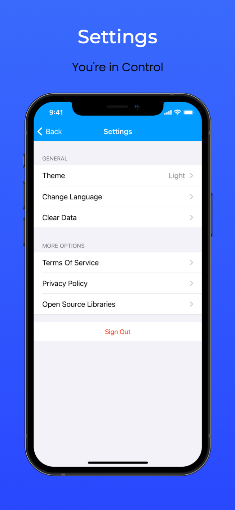
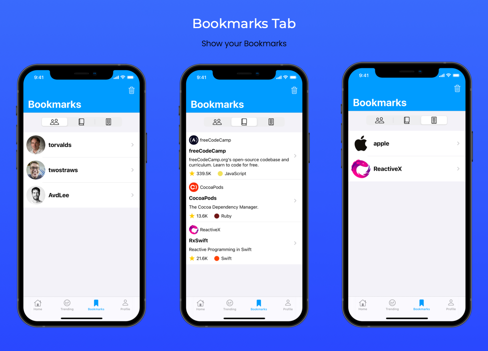
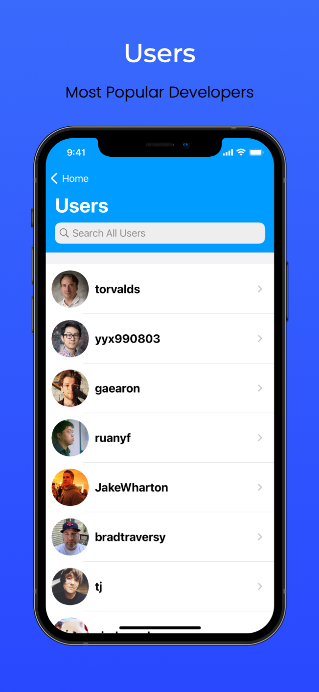
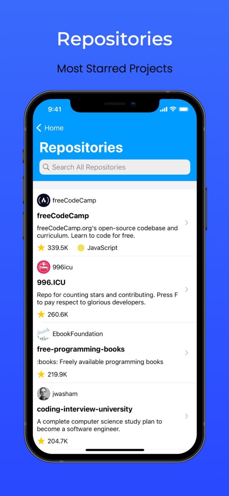
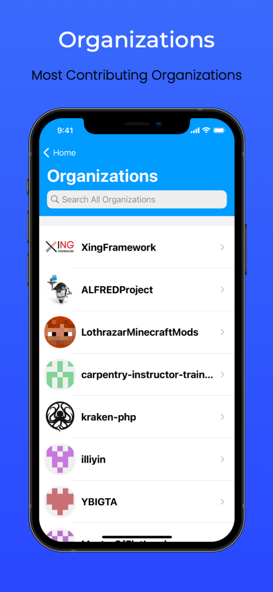

# GitIt

<p align="center">

<br/>
GitIt is GitHub client iOS app with search and trending features.
<br/>
Written in Swift and MVC architecture.
</p>

<p align="center">
    <a href="https://github.com/loay-ashraf/GitIt/actions/workflows/iosCI.yml">
        
    </a>
    <a href="https://github.com/loay-ashraf/GitIt/releases">
    
    </a>
    <a href="https://developer.apple.com/library/archive/documentation/General/Conceptual/DevPedia-CocoaCore/MVC.html">
        
    </a>
    
    
</p>


|         | Features  |
----------|-----------------
:mag: | Search Users, Repositories and Organizations
:fire: | Explore Trending Repositories
:bookmark: | Save your Bookmarks for later
:walking: | Guest Mode
:zap: | Native Markdown Rendering 
:new_moon_with_face: | Dark Theme Support
:saudi_arabia: | Full Arabic (RTL Languages) Support
:octocat: | 100% Open source

## Screenshots

<p align="center">

</p>
<p align="center">





</p>
<p align="center">



</p>
<p align="center">


</p>
<p align="center">

</p>
<p align="center">

</p>


## Demo Video

[](https://www.youtube.com/watch?v=z42uyiRBj6M)

## Installation

### Clone the Repository

```sh
git clone https://github.com/loay-ashraf/GitIt
```

### Install Required pods

```sh
cd GitIt
pod install
```

### (Optionally) Change Client ID and Secret to yours

go to ` GitIt > Commons > Model+Data > Constants > Constants.swift `

```sh
ClientID = "YOUR CLIENT ID GOES HERE"
ClientSecret = "YOUR CLIENT SECRET GOES HERE"
```

## TODOs

### Architecture
* refactor to MVVM Architecture

### Networking
* refactor to new swift concurrency system
* use MOYA??

### Reactive 
* use RXSwift bindings

### Persistence
* use realm?

### Features
* Issues
* Pull Requests

## References

#### API
* [GitHub REST API v3](https://developer.github.com/v3/)

#### Third Party Libraries
* [AlamoFire](https://github.com/Alamofire/Alamofire)
* [InAppSettingsKit](https://github.com/futuretap/InAppSettingsKit)
* [IQKeyboardManager](https://github.com/hackiftekhar/IQKeyboardManager)
* [Kingfisher](https://github.com/onevcat/Kingfisher)
* [MarkdownView](https://github.com/keitaoouchi/MarkdownView)
* [NotificationBannerSwift](https://github.com/Daltron/NotificationBanner)
* [SVProgressHUD](https://github.com/SVProgressHUD/SVProgressHUD)

### Tools
* xCode 13.2
* iPhone 12 Simulator (iOS 14.5)

